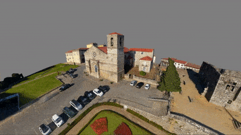
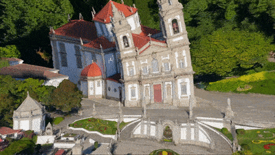

Moebius Transformation Shaders
=================

This repo contains shader code for 4d Moebius transformation of 3d space both in GLSL vertex shade as well as C#. 

Open the Sample Scene and press play. You can fly around as you do in editor by clicking right click mouse and WSAD, press shift to accelerate. You can press T to rotate the hyper Sphere and G to rotate in the other direction. 
This baisicly means with T and G you can increase and decrease the effect strenght. Your control center is in Manager Gameobject and Master script. There you can set some balanacing parameters. The most interesting is probably Camera Centeric. 

Camera Centeric looks like this:

Where as non Camera centeric looks like this:

--- 

If you just want to have a look at the shader, you find the file in Assets/Shaders/Resources/Moebius3D.shader. 
All relevant code is in the vertex shader. 

If you want to grab the C# version, have a look at the Master.cs, MobieusTrasnform(Vector3 pos). 

---

The code is based on the [work](https://gist.github.com/Dan-Piker/f7d790b3967d41bff8b0291f4cf7bd9e) from [Daniel Piker](https://github.com/Dan-Piker). If you would like to have more info about this type of transformation, this video is a [fantastic](https://spacesymmetrystructure.wordpress.com/2008/12/11/4-dimensional-rotations/) visualisation and Daniel has written about his code [here](https://spacesymmetrystructure.wordpress.com/2008/12/11/4-dimensional-rotations/).  

All the meshes in the video and the mesh in the repo are my meshes licensed under Creative Common, you can grab the meshes on my [Sketchfab](https://skfb.ly/6Vorz). 

